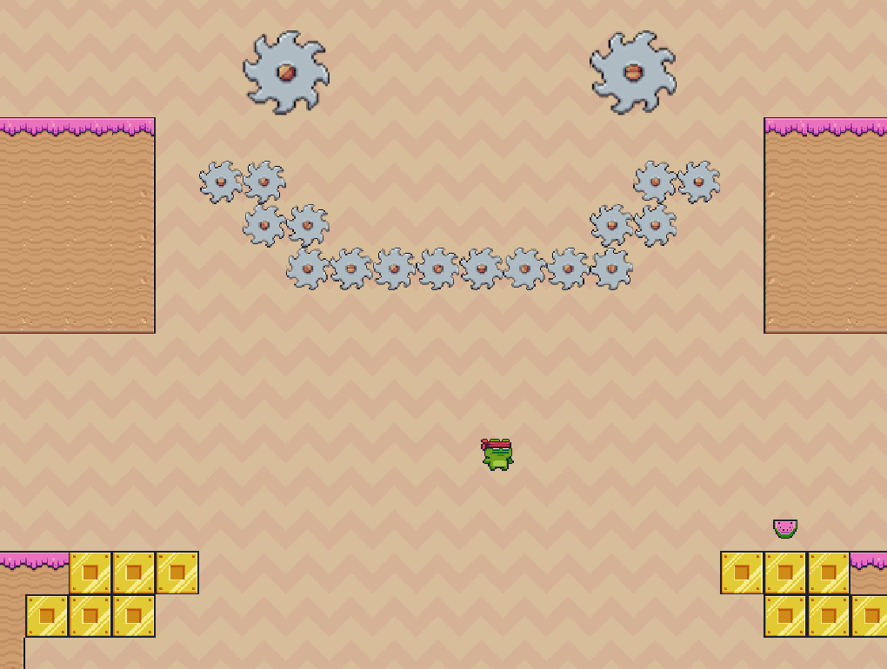
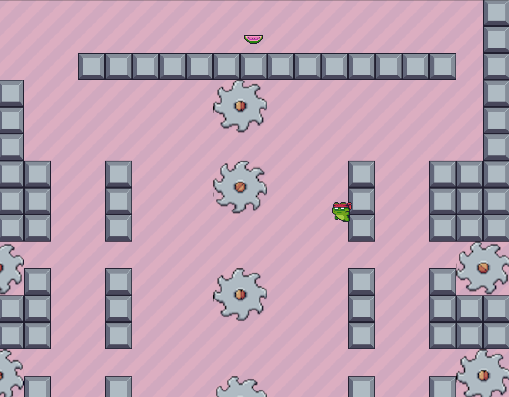
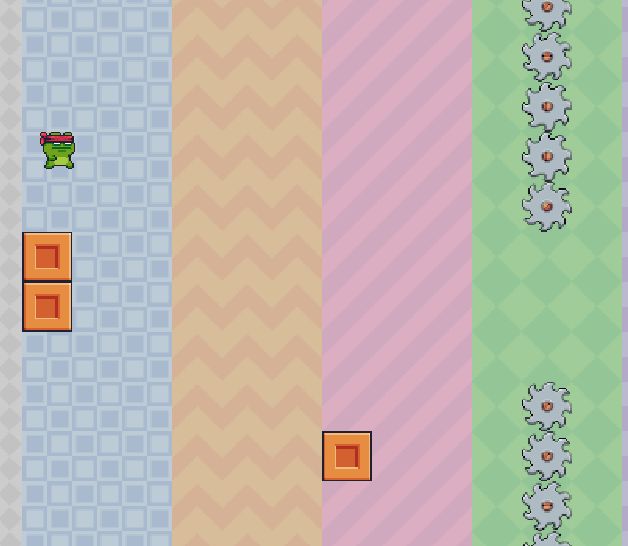

Ninja Frog 
---

Click on the image to play the game!!

Use Left and Right Arrow keys to run left and right. Use up arrow to jump. You can press up arrow while in mid air to double jump! You can also cling on walls by colliding on it while midair and then you can wall jump by pressing up arrow again! 

You are a ninja from a great line of shinobi amphibians. Your mission is to
get all the dragon watermelons so you can bring back your father back to life after
losing him in nam.

Try It
---

CLICK HERE:

Usage
---
go to index.html and run it with live server

Credits
---
PothOnProgramming for World Physics: https://www.youtube.com/channel/UCdS3ojA8RL8t1r18Gj1cl6w
Pixel Frog for Sprite: https://pixel-frog.itch.io/pixel-adventure-1
freesound.org for music and sound effects: https://freesound.org/
